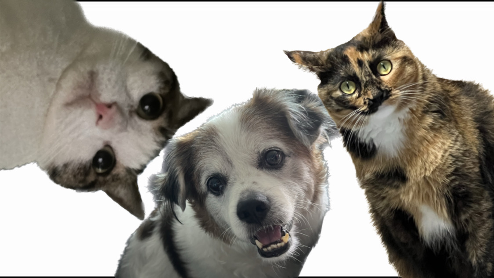

# Section 1
## My name is Chaeyeon
### I'm 4th year CS major
**I love cat**
*I also love dog*
<sub> I will graduate in Fall24 </sub>

> Make everything as simple as possible, but not simpler.

This is my favorite colors:
```
Grey
Black
Navy
```
[This is an external link to my github](https://github.com/ChayPark)

Click [Section1](#section-1) to open the first heading.

[Link to my image](img/0AAF7C87-8546-4675-A5D2-0CC14F268D6C.jpeg)

What computer languages I learned : 
- C
* C++
+ JAVA
+ Python

Favorite computer languages : 
1. JAVA
2. C++
3. Python

TODO 
- [x] Finish 110 lab1
- [ ] Study for CSE 120
- [ ] Review the slides for CSE 107
